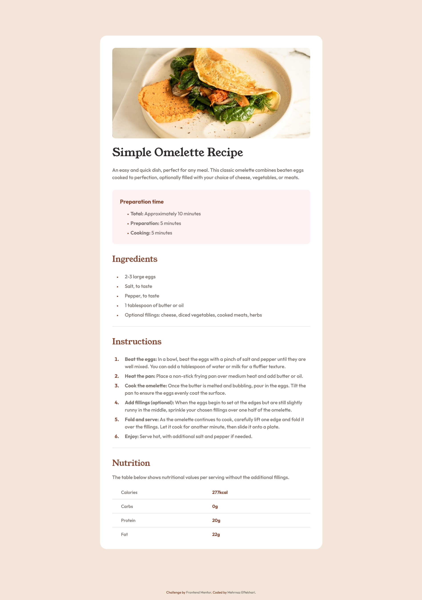
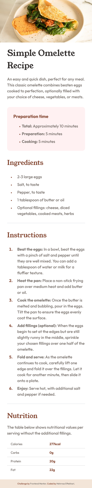

# Frontend Mentor - Recipe page solution

This is a solution to the [Recipe page challenge on Frontend Mentor](https://www.frontendmentor.io/challenges/recipe-page-KiTsR8QQKm). Frontend Mentor challenges help you improve your coding skills by building realistic projects.

## Overview

### Links

- Solution URL: [View solution on GitHub](https://github.com/mehrnaz98/Recipe-page.git)
- Live Site URL: [View on Netlify](https://kaleidoscopic-wisp-fedf99.netlify.app/)

### Screenshot

### Built with

- Semantic HTML5 markup
- CSS custom properties
- Tailwind
